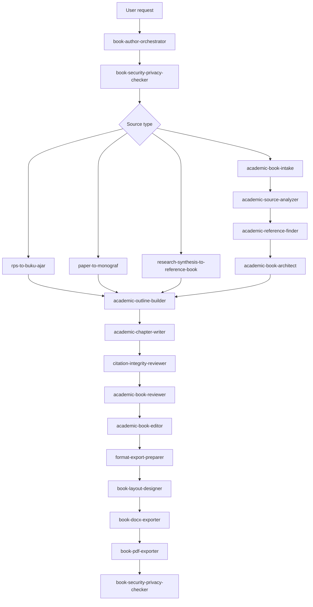
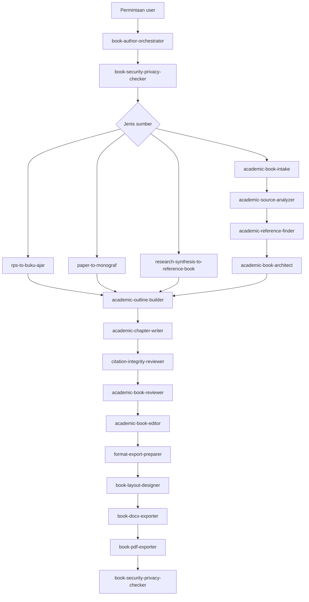

# Book Author Agent Skills

> Bilingual README. English first, Bahasa Indonesia below.

Language: [English](#english) | [Bahasa Indonesia](#bahasa-indonesia)

## English

Book Author Agent Skills is a collection of agent skills for creating **textbooks**, **reference books**, and **monographs** from ideas, RPS/course plans, research papers, or academic source collections. It uses an **orchestrator + specialist agents** pattern: call the orchestrator for an end-to-end workflow, or call a specialist directly for a narrow task.

## GitHub Link

Use your repository link when asking an agent to install the skills:

```text
https://github.com/lensetek/Book-Author-Agent-Skills
```

Replace the link above with the actual GitHub repository URL.

## Description

Supported workflows:

- **Idea to book**: clarify the idea, choose book type, design structure, and build an outline.
- **RPS/course plan to textbook**: convert a syllabus or course plan into a textbook aligned with CPMK/learning outcomes, objectives, exercises, assignments, and assessments.
- **Paper/research to reference book or monograph**: expand papers, theses, dissertations, research reports, or literature sets into larger academic books.
- **Production package**: prepare cover, interior layout, editable DOCX, and final PDF export.

Core principles:

- default output is Indonesian academic prose,
- never fabricate references,
- mark claims that need citations,
- separate facts, assumptions, and interpretations,
- protect credentials, private data, document metadata, and sensitive research material.
- use no-key reference sources first: Crossref, arXiv, PubMed/NCBI, Europe PMC, and unauthenticated Semantic Scholar when available.
- update checks are confirmation-first: the update monitor checks the GitHub repository and asks before download or overwrite.
- writing style is author-driven: users can choose a style guide, calibrate their own voice, and run integrity-focused revision without attempting to bypass AI detectors.

Export defaults:

- Default book/PDF size: `UNESCO`.
- Supported sizes: `UNESCO`, `A5`, `A4`, and `custom`.
- DOCX is the preferred editable handoff for authors, editors, and publishers.
- PDF is the final proof/distribution format after layout and DOCX review.

## Agent List

| Agent | Description | Main tasks | Main output |
| --- | --- | --- | --- |
| `book-author-orchestrator` | Workflow manager for the full academic book process. | Intake, routing, coordination, final checks. | Workflow path, recommended agents, combined output. |
| `agent-skill-update-monitor` | Checks repository updates. | Compare local skills with GitHub, summarize updates, ask before download/update. | Update status and confirmation prompt. |
| `author-writing-style-selector` | Selects book writing style. | Offer style options and create reusable style guide. | Style guide and downstream instructions. |
| `author-voice-calibrator` | Calibrates to the author's own voice. | Analyze permitted writing sample and create voice profile. | Voice profile and revision guidance. |
| `academic-book-intake` | Clarifies the book project. | Define purpose, audience, discipline, book type, sources, standards. | Project brief and next step. |
| `academic-source-analyzer` | Analyzes academic source material. | Extract concepts, learning outcomes, findings, methods, gaps, risks. | Source summary and gap list. |
| `academic-reference-finder` | Finds references without API keys. | Search no-key sources, validate DOI metadata, rank candidates, mark limitations. | Reference candidates and DOI checks. |
| `academic-book-architect` | Designs the book structure. | Decide textbook, reference book, or monograph structure. | Chapter map and rationale. |
| `academic-outline-builder` | Builds detailed outlines. | Create table of contents, chapter goals, summaries, figure/table needs. | Complete outline and chapter plan. |
| `academic-chapter-writer` | Drafts academic chapters. | Write or revise chapters in Indonesian academic style. | Chapter draft and revision notes. |
| `human-revision-assistant` | Guides human revision. | Improve clarity, specificity, examples, author contribution, and non-generic prose. | Human revision tasks and suggested improvements. |
| `originality-integrity-reviewer` | Reviews originality and ethics. | Check author contribution, generic patterns, source integrity, disclosure needs. | Originality and integrity findings. |
| `citation-integrity-reviewer` | Reviews source integrity. | Flag unsupported claims, citation gaps, fabricated-reference risks. | Citation gap list. |
| `rps-to-buku-ajar` | Converts RPS/course plans into textbooks. | Map CPMK/outcomes, topics, exercises, assignments, assessments. | RPS extraction, CPMK-chapter matrix, textbook outline. |
| `paper-to-monograf` | Converts focused research into monographs. | Expand problem, state of the art, method, findings, contribution. | Monograph outline and expansion plan. |
| `research-synthesis-to-reference-book` | Turns literature sets into reference books. | Cluster papers, compare theories/findings, synthesize themes. | Cluster map, synthesis matrix, reference book outline. |
| `academic-book-reviewer` | Reviews academic substance and readiness. | Check contribution, book-type fit, structure, pedagogy, novelty, readiness. | Academic review findings and required revisions. |
| `academic-book-editor` | Edits academic manuscript quality. | Check coherence, flow, terminology, repetition, tone, readability. | Editorial findings and revision plan. |
| `format-export-preparer` | Prepares final manuscript structure. | Build front matter, body, back matter, glossary, bibliography. | Markdown/DOCX-ready structure. |
| `book-layout-designer` | Designs academic book interiors. | Design chapter openers, headers, footers, margins, typography, captions. | Interior layout system. |
| `book-cover-designer` | Designs cover specifications. | Create front cover, back cover, optional spine, visual direction, print notes. | Cover brief and image/design prompt. |
| `book-docx-exporter` | Prepares editable DOCX output. | Define Word styles, page setup, header/footer, TOC, captions, metadata checks. | DOCX-ready export specification. |
| `book-pdf-exporter` | Prepares final PDF output. | Define UNESCO/A5/A4/custom size, print settings, digital settings, preflight. | PDF-ready export specification. |
| `book-security-privacy-checker` | Security and privacy guardrail. | Check credentials, personal data, metadata, frontend-exposed secrets. | Security findings and redaction recommendations. |

## Main Workflow



## Installation

The easiest way is to ask your agent to install the skills from a GitHub link.

```text
Please install Book Author Agent Skills from this GitHub repository:
https://github.com/lensetek/Book-Author-Agent-Skills

Install them as agent skills in this project.

After installation, verify and report:
1. how many agent skills were installed,
2. the name of each installed agent,
3. whether every agent has a SKILL.md file,
4. whether book-author-orchestrator is installed,
5. whether book-security-privacy-checker is installed.

Do not overwrite existing agent skills without confirmation.
```

Expected confirmation:

```text
Installation completed.
Total installed agent skills: 24

Installed agents:
- book-author-orchestrator
- agent-skill-update-monitor
- author-writing-style-selector
- author-voice-calibrator
- academic-book-intake
- academic-source-analyzer
- academic-reference-finder
- academic-book-architect
- academic-outline-builder
- academic-chapter-writer
- human-revision-assistant
- originality-integrity-reviewer
- citation-integrity-reviewer
- rps-to-buku-ajar
- paper-to-monograf
- research-synthesis-to-reference-book
- academic-book-reviewer
- academic-book-editor
- format-export-preparer
- book-layout-designer
- book-cover-designer
- book-docx-exporter
- book-pdf-exporter
- book-security-privacy-checker

Every agent has a SKILL.md file.
Orchestrator installed: yes.
Security/privacy checker installed: yes.
```

## Usage Examples

```text
Use book-author-orchestrator. I have an idea for a book about AI for SME marketing. Create a project brief and reference book outline.
```

```text
Use agent-skill-update-monitor. Check the GitHub repository for updates and ask me before downloading or updating any installed skill.
```

```text
Use author-writing-style-selector. Help me choose a writing style for this textbook and create a style guide for all chapter agents.
```

```text
Use author-voice-calibrator. Analyze my writing sample and create a voice profile that preserves academic integrity.
```

```text
Use human-revision-assistant. Help me revise this chapter so it is clearer, more specific, and grounded in my own examples and contribution.
```

```text
Use originality-integrity-reviewer. Review this manuscript for originality, author contribution, source integrity, and academic ethics before submission.
```

```text
Use academic-reference-finder. Find recent references for this chapter using no-key sources only: Crossref, arXiv, PubMed, Europe PMC, and public Semantic Scholar access.
```

```text
Use book-cover-designer. Create a front and back cover brief for my monograph using UNESCO size.
```

```text
Use book-docx-exporter. Prepare this manuscript for editable DOCX export with headers, footers, TOC, and chapter styles.
```

```text
Use book-pdf-exporter. Prepare final PDF export settings for A5 and include a preflight checklist.
```

## Usage In Other Agent Apps

For Claude, Antigravity, Cursor, ChatGPT custom agents, LangGraph, CrewAI, AutoGen, or other systems: give the agent the GitHub repository link, ask it to install the repository as agent skills in the project, then verify the installed agent count and `SKILL.md` files. If the app cannot install from GitHub automatically, paste the relevant `SKILL.md` content into the app's system instruction, project instruction, or agent prompt.

## Portable Agent Contract

```json
{
  "task": "what the user wants",
  "book_type": "textbook | reference_book | monograph | undecided",
  "source_type": "idea | rps | single_paper | multiple_papers | mixed",
  "discipline": "field or course",
  "audience": "target readers",
  "constraints": ["publisher/campus/style requirements"],
  "source_material": "text, file summary, or references",
  "desired_output": "brief | references | outline | chapter | review | edit | cover | layout | docx | pdf | final_package"
}
```

## Security Principles

Every workflow must run security and privacy checks at the beginning and at the end. Flag API keys, tokens, passwords, database credentials, `.env`, cloud credentials, student/respondent data, confidential institutional information, frontend-exposed secrets such as `VITE_*`, and document metadata. Never repeat secret values in the output.

---

## Bahasa Indonesia

Book Author Agent Skills adalah kumpulan agent skills untuk membuat **buku ajar**, **buku referensi**, dan **monograf** dari ide, RPS, paper penelitian, atau kumpulan sumber akademik. Paket ini memakai pola **orchestrator + specialist agents**: panggil orchestrator untuk workflow lengkap, atau panggil specialist untuk tugas spesifik.

## Link GitHub

Gunakan link repository ketika meminta agent menginstall skills:

```text
https://github.com/lensetek/Book-Author-Agent-Skills
```

Ganti link di atas dengan URL repository GitHub yang sebenarnya.

## Deskripsi

Workflow yang didukung:

- **Dari ide ke buku**: mematangkan gagasan, memilih jenis buku, merancang struktur, dan membuat outline.
- **Dari RPS ke buku ajar**: mengubah RPS/silabus menjadi buku ajar yang selaras dengan CPMK, tujuan pembelajaran, latihan, tugas, dan asesmen.
- **Dari paper/riset ke buku referensi atau monograf**: mengembangkan paper, tesis, disertasi, laporan riset, atau kumpulan literatur menjadi buku akademik.
- **Paket produksi**: menyiapkan cover, layout interior, DOCX editable, dan PDF final.

Prinsip utama:

- output default adalah Bahasa Indonesia akademik,
- tidak membuat referensi palsu,
- menandai klaim yang perlu sitasi,
- membedakan fakta, asumsi, dan interpretasi,
- menjaga credential, data pribadi, metadata dokumen, dan materi riset sensitif.
- memakai sumber referensi tanpa API key lebih dulu: Crossref, arXiv, PubMed/NCBI, Europe PMC, dan Semantic Scholar tanpa autentikasi bila tersedia.
- pengecekan update harus konfirmasi dulu: update monitor mengecek repository GitHub dan bertanya sebelum download atau overwrite.
- gaya penulisan ditentukan penulis: pengguna bisa memilih style guide, mengkalibrasi suara penulis sendiri, dan menjalankan revisi berorientasi integritas tanpa mencoba mengelabui AI detector.

Default export:

- Ukuran buku/PDF default: `UNESCO`.
- Ukuran yang didukung: `UNESCO`, `A5`, `A4`, dan `custom`.
- DOCX adalah format utama untuk editing dan handoff ke penulis/editor/penerbit.
- PDF adalah format final untuk proof/distribusi setelah layout dan DOCX direview.

## Daftar Agent

| Agent | Deskripsi | Tugas utama | Output utama |
| --- | --- | --- | --- |
| `book-author-orchestrator` | Manager workflow untuk proses buku akademik lengkap. | Intake, routing, koordinasi, final check. | Jalur kerja, rekomendasi agent, output gabungan. |
| `agent-skill-update-monitor` | Mengecek update repository. | Membandingkan skill lokal dengan GitHub, merangkum update, meminta konfirmasi sebelum download/update. | Status update dan prompt konfirmasi. |
| `author-writing-style-selector` | Memilih gaya penulisan buku. | Menawarkan opsi gaya dan membuat style guide reusable. | Style guide dan instruksi downstream. |
| `author-voice-calibrator` | Mengkalibrasi suara penulis sendiri. | Menganalisis contoh tulisan yang diizinkan dan membuat voice profile. | Voice profile dan panduan revisi. |
| `academic-book-intake` | Mengklarifikasi proyek buku. | Menentukan tujuan, audiens, disiplin, jenis buku, sumber, standar. | Project brief dan langkah berikutnya. |
| `academic-source-analyzer` | Menganalisis sumber akademik. | Mengekstrak konsep, CPMK, temuan, metode, gap, risiko. | Ringkasan sumber dan daftar gap. |
| `academic-reference-finder` | Mencari referensi tanpa API key. | Mencari di sumber no-key, validasi DOI, ranking kandidat, menandai limitasi. | Kandidat referensi dan cek DOI. |
| `academic-book-architect` | Merancang struktur buku. | Menentukan struktur buku ajar, referensi, atau monograf. | Chapter map dan rationale. |
| `academic-outline-builder` | Menyusun outline detail. | Membuat daftar isi, tujuan bab, ringkasan, kebutuhan gambar/tabel. | Outline lengkap dan chapter plan. |
| `academic-chapter-writer` | Menulis bab akademik. | Menulis atau merevisi bab dengan gaya akademik Indonesia. | Draft bab dan catatan revisi. |
| `human-revision-assistant` | Memandu revisi manusia. | Memperjelas tulisan, menambah kekhususan, contoh, kontribusi penulis, dan mengurangi kesan generik. | Tugas revisi manusia dan saran perbaikan. |
| `originality-integrity-reviewer` | Mereview orisinalitas dan etika. | Mengecek kontribusi penulis, pola generik, integritas sumber, kebutuhan disclosure. | Temuan orisinalitas dan integritas. |
| `citation-integrity-reviewer` | Mengecek integritas sumber. | Menandai klaim tanpa sumber, gap sitasi, risiko referensi palsu. | Citation gap list. |
| `rps-to-buku-ajar` | Mengubah RPS menjadi buku ajar. | Memetakan CPMK, topik, latihan, tugas, asesmen. | Ekstraksi RPS, matriks CPMK-bab, outline buku ajar. |
| `paper-to-monograf` | Mengubah riset terfokus menjadi monograf. | Mengembangkan problem, state of the art, metode, temuan, kontribusi. | Outline monograf dan rencana ekspansi. |
| `research-synthesis-to-reference-book` | Mengubah kumpulan literatur menjadi buku referensi. | Mengelompokkan paper, membandingkan teori/temuan, menyintesis tema. | Cluster map, synthesis matrix, outline buku referensi. |
| `academic-book-reviewer` | Mereview substansi dan kelayakan akademik. | Mengecek kontribusi, kesesuaian jenis buku, struktur, pedagogi, novelty, readiness. | Temuan review akademik dan revisi wajib. |
| `academic-book-editor` | Mengedit kualitas naskah akademik. | Mengecek koherensi, flow, istilah, repetisi, tone, keterbacaan. | Editorial findings dan rencana revisi. |
| `format-export-preparer` | Menyiapkan struktur naskah final. | Membuat front matter, body, back matter, glosarium, bibliografi. | Struktur Markdown/DOCX-ready. |
| `book-layout-designer` | Mendesain interior buku akademik. | Mendesain halaman pembuka bab, header, footer, margin, tipografi, caption. | Sistem layout interior. |
| `book-cover-designer` | Mendesain spesifikasi cover. | Membuat cover depan, belakang, optional punggung buku, arah visual, print notes. | Brief cover dan prompt desain/gambar. |
| `book-docx-exporter` | Menyiapkan output DOCX editable. | Menentukan style Word, ukuran halaman, header/footer, TOC, caption, metadata check. | Spesifikasi export DOCX-ready. |
| `book-pdf-exporter` | Menyiapkan output PDF final. | Menentukan ukuran UNESCO/A5/A4/custom, print settings, digital settings, preflight. | Spesifikasi export PDF-ready. |
| `book-security-privacy-checker` | Guardrail keamanan dan privasi. | Mengecek credential, data pribadi, metadata, secret frontend. | Temuan keamanan dan rekomendasi redaksi. |

## Workflow Utama



## Instalasi

```text
Tolong install Book Author Agent Skills dari repository GitHub ini:
https://github.com/lensetek/Book-Author-Agent-Skills

Install menjadi agent skills di project ini.

Setelah install, cek dan konfirmasi:
1. berapa agent skill yang terinstall,
2. nama setiap agent yang terinstall,
3. apakah setiap agent punya SKILL.md,
4. apakah book-author-orchestrator terinstall,
5. apakah book-security-privacy-checker terinstall.

Jangan overwrite agent skills yang sudah ada tanpa konfirmasi.
```

Output konfirmasi yang diharapkan:

```text
Install selesai.
Total agent skill terinstall: 24

Daftar agent:
- book-author-orchestrator
- agent-skill-update-monitor
- author-writing-style-selector
- author-voice-calibrator
- academic-book-intake
- academic-source-analyzer
- academic-reference-finder
- academic-book-architect
- academic-outline-builder
- academic-chapter-writer
- human-revision-assistant
- originality-integrity-reviewer
- citation-integrity-reviewer
- rps-to-buku-ajar
- paper-to-monograf
- research-synthesis-to-reference-book
- academic-book-reviewer
- academic-book-editor
- format-export-preparer
- book-layout-designer
- book-cover-designer
- book-docx-exporter
- book-pdf-exporter
- book-security-privacy-checker

Semua agent memiliki SKILL.md.
Orchestrator terinstall: ya.
Security/privacy checker terinstall: ya.
```

## Contoh Penggunaan

```text
Gunakan book-author-orchestrator. Saya punya ide buku tentang AI untuk pemasaran UMKM. Buatkan project brief dan outline buku referensi.
```

```text
Gunakan agent-skill-update-monitor. Cek apakah ada update di repository GitHub dan tanya saya dulu sebelum download atau update skill yang terinstall.
```

```text
Gunakan author-writing-style-selector. Bantu saya memilih gaya penulisan untuk buku ajar ini dan buat style guide untuk semua agent penulis bab.
```

```text
Gunakan author-voice-calibrator. Analisis contoh tulisan saya dan buat voice profile yang tetap menjaga integritas akademik.
```

```text
Gunakan human-revision-assistant. Bantu revisi bab ini agar lebih jelas, spesifik, dan berisi contoh serta kontribusi saya sendiri.
```

```text
Gunakan originality-integrity-reviewer. Review naskah ini untuk orisinalitas, kontribusi penulis, integritas sumber, dan etika akademik sebelum submission.
```

```text
Gunakan academic-reference-finder. Cari referensi terbaru untuk bab ini hanya memakai sumber tanpa API key: Crossref, arXiv, PubMed, Europe PMC, dan akses publik Semantic Scholar.
```

```text
Gunakan book-cover-designer. Buat brief cover depan dan belakang untuk monograf saya dengan ukuran UNESCO.
```

```text
Gunakan book-docx-exporter. Siapkan naskah ini untuk export DOCX editable dengan header, footer, TOC, dan style bab.
```

```text
Gunakan book-pdf-exporter. Siapkan pengaturan export PDF final ukuran A5 dan sertakan preflight checklist.
```

## Kontrak Agent Portabel

```json
{
  "task": "apa yang user minta",
  "book_type": "buku ajar | buku referensi | monograf | belum ditentukan",
  "source_type": "idea | rps | single_paper | multiple_papers | mixed",
  "discipline": "bidang atau mata kuliah",
  "audience": "target pembaca",
  "constraints": ["standar penerbit/kampus/gaya"],
  "source_material": "teks, ringkasan file, atau referensi",
  "desired_output": "brief | references | outline | chapter | review | edit | cover | layout | docx | pdf | final_package"
}
```

## Prinsip Keamanan

Semua workflow wajib menjalankan pemeriksaan keamanan dan privasi di awal dan akhir proses. Tandai API key, token, password, credential database, `.env`, cloud credential, data mahasiswa/responden, informasi institusi rahasia, secret frontend seperti `VITE_*`, dan metadata dokumen. Jangan pernah menampilkan ulang nilai secret di output.
